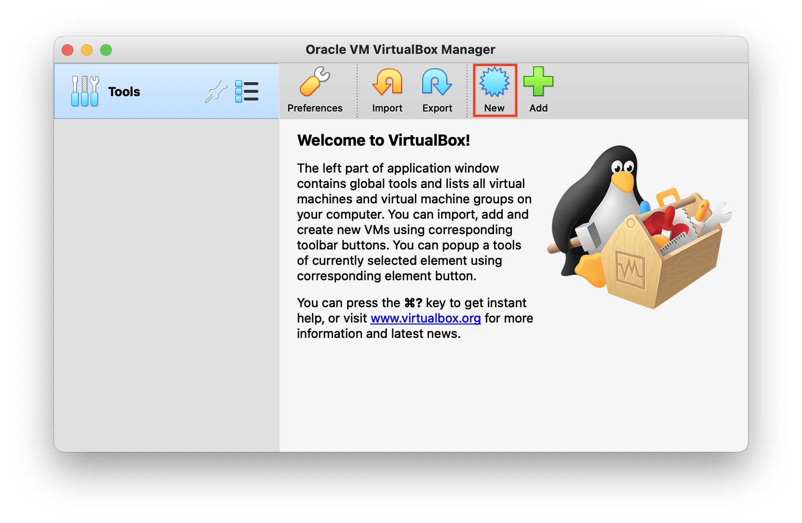
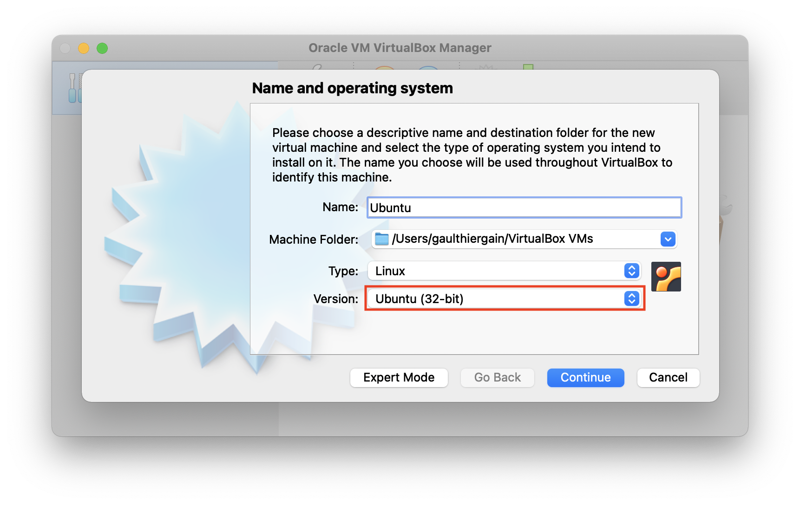
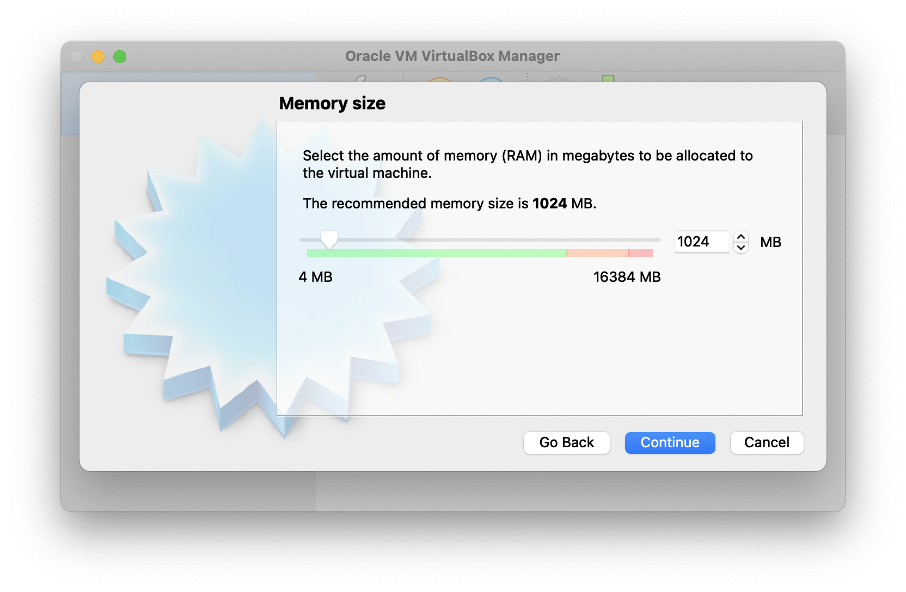
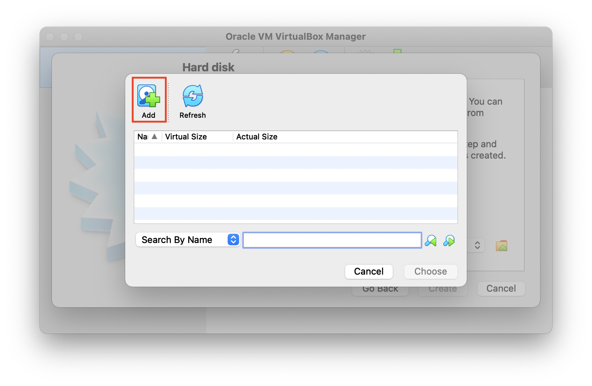
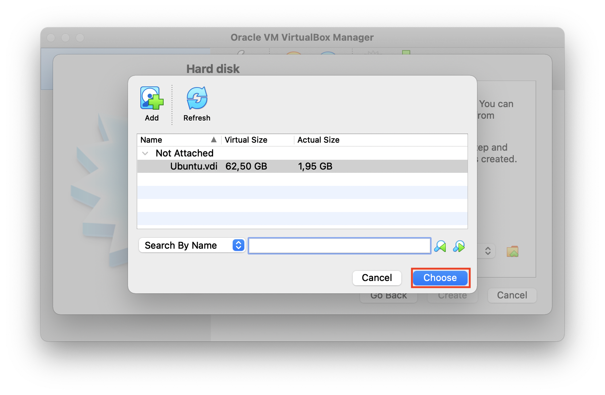
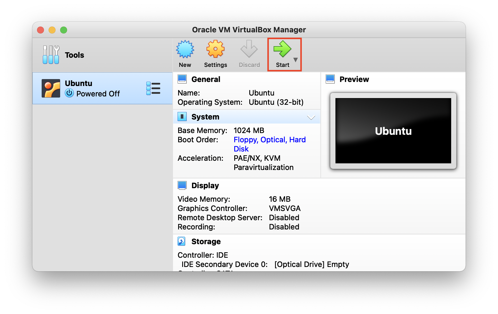
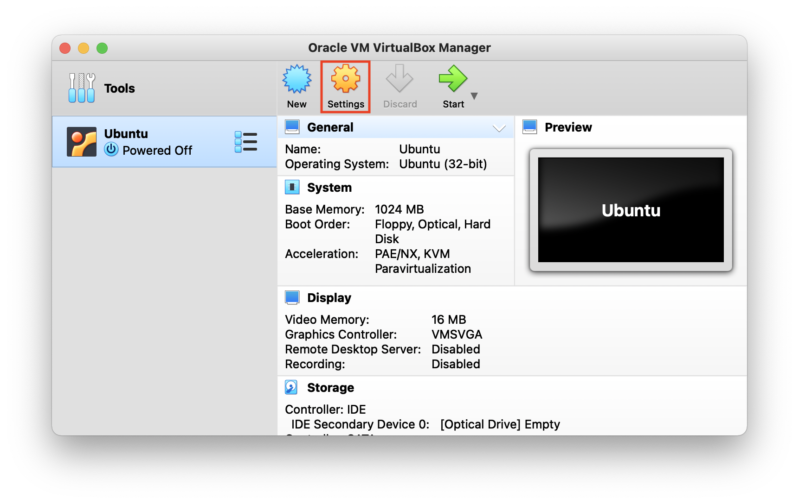
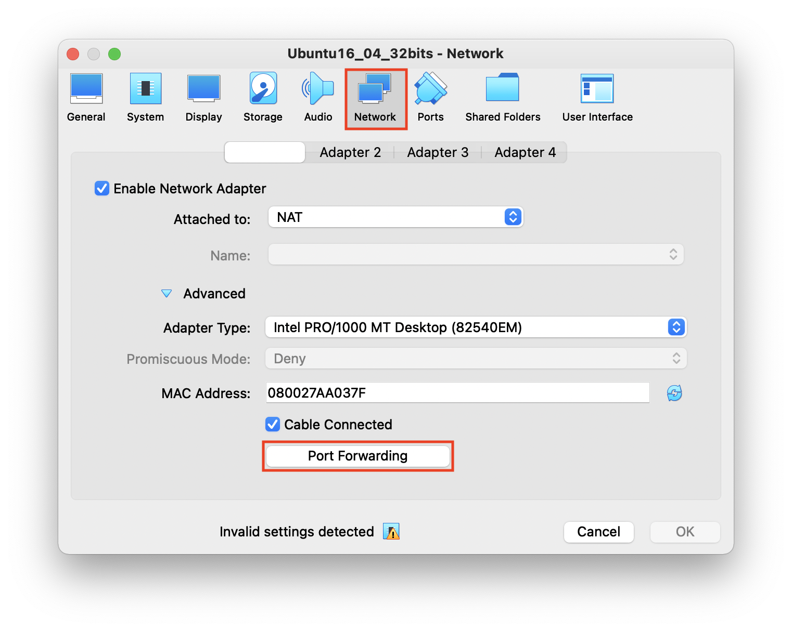
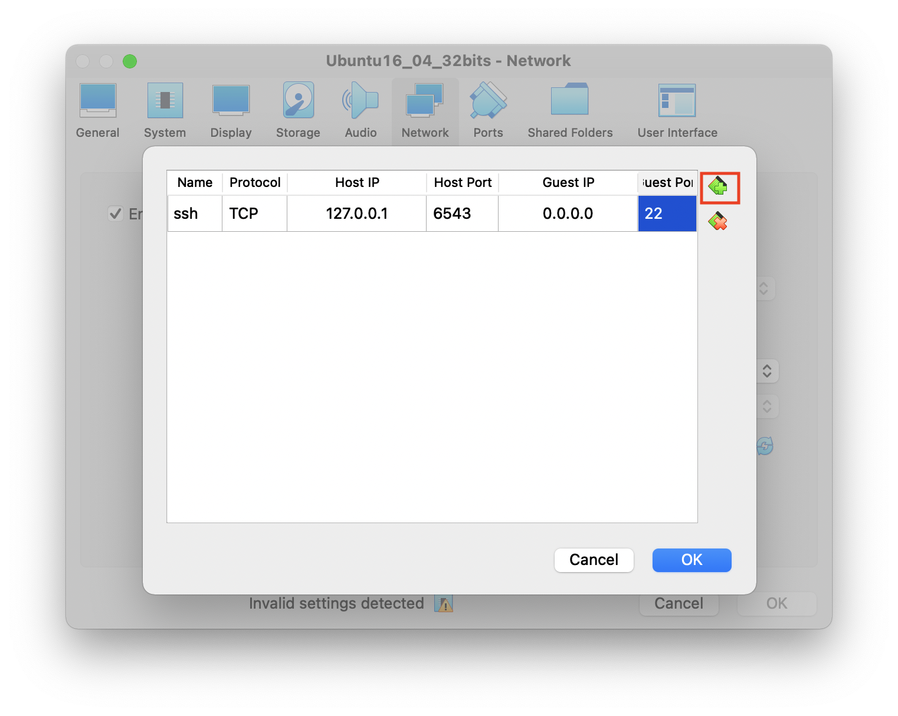

Setting Up a VM on Linux/Windows and Mac (intel chips)
======================================================

You need to have a working virtual machine for the lab work therefore you must follow this tutorial carefully in order to have a functional setup before starting the lab work. We decided to choose Kali Linux (VM) for the lab.  

Installing VirtualBox
---------------------

.. danger:: If you have a recent Macbook (with a m1 chip), skip VirtualBox steps and go `here <macsetup.html>`_ instead.

First download the VirtualBox installer from `official web page <https://www.virtualbox.org/>`_ according to your OS. After finishing the download, launch the installer and follow the instruction of the installer.
VirtualBox is a virtualization software which allows you to create VMs that run OSes including Linux on your computer without removing your currently-using OSes such as Windows and macOS. In this course, we execute Linux on the VM made by VirtualBox.

Download the reference VM image
-------------------------------

Then download the reference Kali Linux image from `this link <https://www.kali.org/get-kali/#kali-virtual-machines>`_.
The image contains Kali Linux 64bits. The default user of the VM image is ``kali``. The password for the user is also ``kali``.

Launch the downloaded VM image on VirtualBox
--------------------------------------------

We will create a new virtual machine based on the reference image:

1. Click on the "New" icon in the toolbar to launch the creation wizard and create a new VM.

2. The first thing to do is to define the name, the type of virtual machine and the version you want to create. In our case, we chose to name the machine ``Ubuntu``. The type will be Linux and the Ubuntu **32 bits** version.

3. Next, you need to define the amount of memory to be allocated to the virtual machine. The memory will be shared with the host system each time the virtual machine is started. You have to make sure not to go below the recommended minimum. In addition, you must also make sure to leave enough memory for the host operating system to continue running. We recommend a minimum of 1024MB but if you have enough memory on your system, you can slide the bar up to 2048MB.

4. The next step is to use a virtual hard disk. Like shared memory, this is the storage space that will be allocated to the virtual machine. In this case, we will use the virtual hard disk you downloaded (``Ubuntu.vdi``). Click the "Use an existing virtual hard disk file" option. A new window will open. Click on the "Add" button then select the file 
``Ubuntu.vdi`` by browsing your file explore (it should normally be in your "Downloads" folder).

5. Once you have selected the file in the file explorer, select it again in the modal window and click on the "Choose" button.

6. The virtual machine has now been created. You can launch it by pressing the "Start" button located at the top of the toolbar.

7. Once the initialization phase is complete, the console login screen appears. The password to log in is the same as the user name, i.e. ``student``.

.. danger:: If your VM does not boot it may be related to the VT-x technology in most cases. To handle this issue, shutdown your (host) machine, open your BIOS settings, and enable Virtual Technology-x option. Finally restart your machine and test again.

Connect to the VM via ssh
-------------------------

In order to connect to a VM using `ssh <https://www.ssh.com/ssh/>`_, we need a special network setup in VirtualBox. Four of the network cards can be configured in the Network section of the Settings dialog in the graphical user interface of Oracle VM VirtualBox.

NAT: VirtualBox act as a normal process which tries to access the web when the VM initiates a connection (**default**).
    * +Simple.
    * -Virtual machine not accessible from outside, not even from host.
Bridge: VirtualBox plugs itself to the real card, and acts as if you used a switch.
    * +Access from outside (from the world only if you get public IP address).
    * -Don't work with Wifi (do not work on ULiège Wifi, but does work on ms8xx machines).
Internal Network: Network between VMs, invisible to the host or the outside.
    * +Secure communication between VMs.
    * -No access to or from host or outside (no internet).
Host private network: Like internal network but creates a virtual interface on the host too.
    * +Fine-tuning is possible (router on the host, ...).
    * -Internet connection tricky to configure (create a router between virtual interface on host and the real. interface).

In our case, we will use **NAT** Network (default option). In order to configure this mode, click on "Setting", and choose "Network" tab in the settings menu.

Then click on "Advanced", and choose "Port Forwarding".

Finally, click on the green "+" button, and type the following information. This allows to connect to the remove virtual machine through localhost by using the "6543" port on the host machine (your computer).

Further details about the configuration:

* Name: ssh (anything would be fine but try to be consistent)
* Protocol: TCP
* Host IP: 127.0.0.1 (localhost)
* Host Port: 6543 (mostly any number [>1024] would be OK but remember it!)
* Guest Port: 22 (ssh port)

Connect to the VM by ssh
------------------------

Then open a terminal and enter the following commands::

  $ ssh kali@127.0.0.1 -p 6543

The VM will ask your password. In that case, use the "kali" credentials. Note that if you are using Windows, you can use PowerShell or CommandPrompt or `putty <https://www.putty.org>`_.

Update package information
--------------------------

Finally, enter the following command on your terminal app after connecting to the VM by ssh::

  $ sudo apt update
